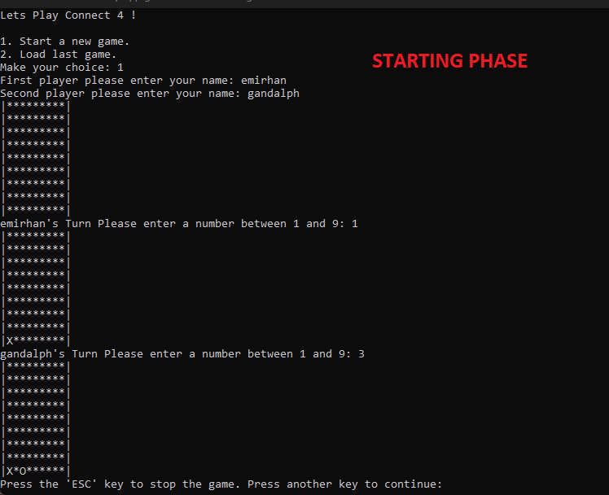

# Connect 4 Game

## Introduction
In this project, Connect 4 game is implemented using file structures. The game is played on a console as shown in the image below. Due to gravity, a disc dropped into any column will fall down until it lands on another disc or reaches the bottom of the grid. Each column is independent, so a disc dropped in one column cannot move to another column.

## How to Play
- The game is played by two players taking turns.
- Each player has their own colored discs.
- Players drop their discs into any available column, and the disc falls to the lowest available slot in that column.
- The player who aligns four discs of their color first wins the game.
- If all slots are filled and no player has formed a line of four, the game ends in a draw.

*Game Board: Connect 4 game is played on a console.*

## Winning Condition

The objective of the game is to align four discs of your color (either horizontally, vertically, or diagonally) before the opponent does. In the example above, the player with 'X' discs wins by aligning four discs diagonally.

*Winning Condition: Four 'X' discs in a diagonal line.*

## Game Board Logs
The game board logs are displayed as a visual representation of the current state of the game board. Each slot is marked with 'O' for player 1 (yellow) and 'X' for player 2 (red).

*Game Board Logs: Current state of the game board.*

## Player Moves Log
The player moves log shows the sequence of moves made by each player during the game. Each move is displayed as the column number where the player placed their disc.

*Player Moves Log: Sequence of moves made by each player.*

## File Structure
The game utilizes two text files:
1. `Board.txt`: This file stores the current state of the 9x9 game board. Each slot can be empty or occupied by a disc of a specific player. After each move, the board is updated.
2. `Moves.txt`: This file records the moves made by each player. The moves are logged as the row and column addresses of the slot where the disc is placed.

## Getting Started
To play the Connect 4 game:
1. Clone or download the repository.
2. If you're using Visual Studio:

         Open the project in Visual Studio.

         Build the solution.

         Run the project.

   If you have the executable file:

         Double-click the executable to launch the game.
    

During the game, players can choose to save and exit. When the "Load last game" option is selected from the main menu, the game resumes from where it was left off by reading the state from the files.

Feel free to contribute, report issues, or suggest improvements.

Enjoy playing Connect 4!
